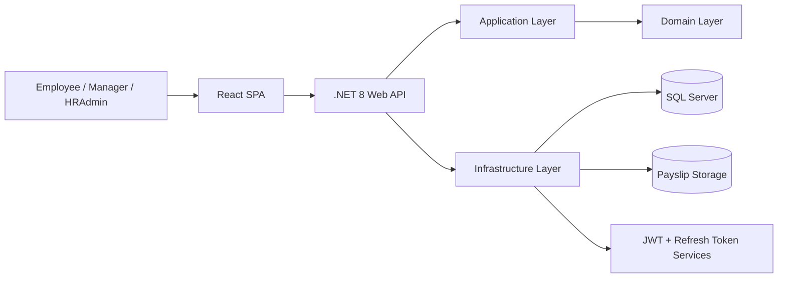
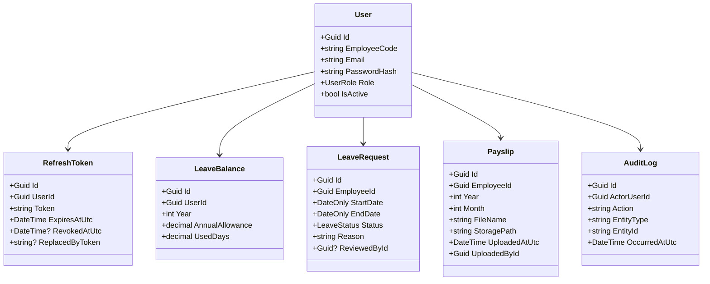
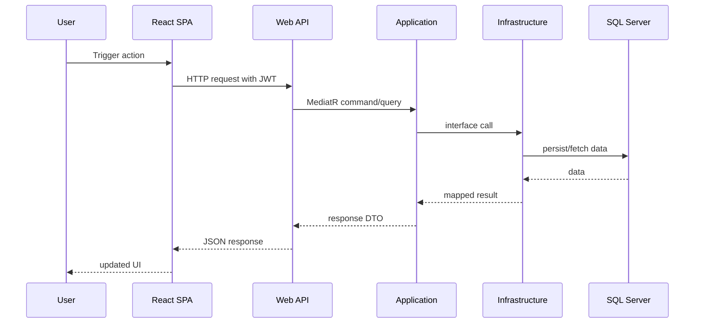

# Architecture

## Overview

The HRMS Self-Service Portal is a full-stack enterprise-style application built with strict Clean Architecture boundaries and feature-oriented delivery.

It is designed to simulate a realistic internal HR product rather than a public SaaS product.

## Architectural Goals

- Clear separation of concerns
- Testable application core
- Replaceable infrastructure
- Secure authentication and authorization
- Incremental delivery through CQRS-style use cases
- Portfolio-ready code quality and documentation

## System Context



## Layer Responsibilities

### Domain
Contains:
- entities
- enums
- value objects
- base domain abstractions
- domain exceptions only if needed

Must not contain:
- EF Core
- MediatR
- FluentValidation
- HTTP concerns
- JWT logic
- file handling
- serialization concerns

### Application
Contains:
- use cases
- CQRS commands and queries
- handlers
- DTOs
- interfaces
- validators
- authorization abstractions
- business rules orchestration

Application may depend on:
- Domain

Application must not depend on:
- EF Core
- SQL Server
- ASP.NET Core
- file system implementations

### Infrastructure
Contains:
- EF Core DbContext
- repository implementations
- data access
- migrations
- JWT token generation service
- password hashing service
- refresh token persistence
- file storage implementation
- audit persistence

Infrastructure depends on:
- Application
- Domain

### API
Contains:
- controllers
- request/response transport models where needed
- middleware
- exception handling
- authentication setup
- Swagger configuration
- DI composition root

API depends on:
- Application
- Infrastructure only at DI registration boundary

## High-Level Backend Solution Structure

```text
backend/
├─ src/
│  ├─ Hrms.Domain/
│  │  ├─ Common/
│  │  ├─ Entities/
│  │  ├─ Enums/
│  │  └─ ValueObjects/
│  ├─ Hrms.Application/
│  │  ├─ Common/
│  │  ├─ Abstractions/
│  │  ├─ Authentication/
│  │  ├─ LeaveManagement/
│  │  └─ Payslips/
│  ├─ Hrms.Infrastructure/
│  │  ├─ Persistence/
│  │  ├─ Authentication/
│  │  ├─ FileStorage/
│  │  ├─ Audit/
│  │  └─ DependencyInjection/
│  └─ Hrms.API/
│     ├─ Controllers/
│     ├─ Middleware/
│     ├─ Extensions/
│     └─ OpenApi/
└─ tests/
```

## Frontend Architecture

### Principles
- Route-driven feature organization
- Strong separation between UI, data access, and state
- Server state managed by TanStack Query
- Local/global UI state managed minimally via Zustand
- Shared layout, auth, and route guards

## High-Level Frontend Structure

```text
frontend/
├─ src/
│  ├─ app/
│  │  ├─ router/
│  │  ├─ providers/
│  │  └─ store/
│  ├─ api/
│  ├─ features/
│  │  ├─ auth/
│  │  ├─ leave/
│  │  └─ payslips/
│  ├─ components/
│  ├─ pages/
│  ├─ hooks/
│  ├─ lib/
│  └─ types/
└─ tests/
```

## Module Boundaries

### Authentication & Identity
Responsibilities:
- login
- refresh token rotation
- session persistence
- user claims
- role checks

### Leave Management
Responsibilities:
- submit leave
- approve/reject leave
- calculate balances
- validate overlapping requests
- expose history

### Payslip Viewer
Responsibilities:
- upload PDF metadata and file
- authorize download
- record audit events for upload/download

## Data Model Overview



## Request Flow



## Security Architecture

### Access tokens
- short-lived JWT access tokens
- claims include user id, employee code, role

### Refresh tokens
- persisted server-side
- rotated on refresh
- old token revoked when a new one is issued
- token family relationships stored where helpful for compromise detection

### Passwords
- BCrypt hashes only
- no plaintext storage
- no reversible encryption

### Authorization
- API-level policy enforcement
- application-level ownership checks for sensitive data
- role-based route guarding on frontend is UX only, never security boundary

## File Storage Strategy For Payslips

For local development:
- store PDFs on local mounted storage path
- persist only metadata in SQL Server
- never store PDF binary directly in the main relational tables for MVP

Potential future swap:
- S3 / Azure Blob / private object storage

## Audit Strategy

Audit the following:
- login success/failure where appropriate
- refresh token use/revocation
- leave submission
- leave approval/rejection
- payslip upload
- payslip download

Audit records must include:
- actor
- action
- target entity
- timestamp
- relevant correlation/id metadata where practical

## Scalability Notes

This is an internal portal, so the MVP prioritizes correctness, security, and maintainability over hyperscale patterns.

Still, the design supports future evolution:
- infrastructure can be swapped without touching application core
- handlers can later publish domain/integration events
- object storage can replace local file storage
- auth can later integrate with SSO

## Architectural Trade-offs

- MediatR is used for clarity and modularity, not because every request needs complex CQRS
- SQL Server is chosen for enterprise realism and strong interview signaling
- Local file storage is acceptable for MVP but abstracted for future replacement
- Refresh token rotation adds complexity but meaningfully improves security credibility

## Definition of Architectural Compliance

A change is architecturally compliant only if:
- layer references follow the documented rules
- business logic is not hidden in controllers
- infrastructure details do not leak into application contracts
- domain model remains framework-light
